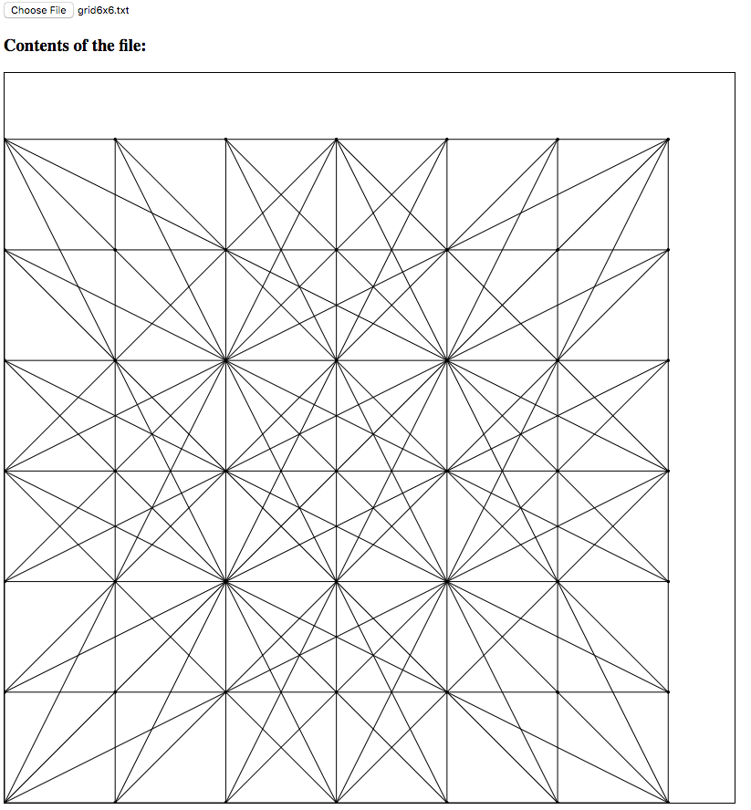

# Algorithms, 4th edition
A collection of notes and solutions created for Algorithms, 4th ed. by Robert Sedgewick and Kevin Wayne

## Running the Code
The output for all code can be run with the newest version of node (tested on `v6.9.3`), which supports ES2015 syntax.
For older versions, transpilation using a `Babel` watcher or using `babel-node` is required. To run the code, simply 
execute `node [filename]` in the `/src` directory.

## Using the Notes
The notes were written for personal benefit and reference and were intended neither as a substitute for the book nor a comprehensive reference. They are included here for completeness and can be accessed through the `/notes` directory or via the Table of Contents.

## Table of Contents
1. Case Study: Union Find
  - [Chapter Notes](./notes/1.5-union-find.md)
    - dynamic connectivity, quick-find, quick-union, weighted quick-union, path compression
  - [Quick Find](./src/union-find/quickFind.js)
  - [Quick Union](./src/union-find/quickUnion.js)
  - [Weighted Quick Union with Path Compression](./src/union-find/weightedQuickUnion.js) *
  - [Percolation](.//notes/1.5-percolation.md) *
  - [Percolation Stats](./notes/1.5-percolationStats.md)
  - [Successor With Delete](./src/interview-problems/successorWithDelete.js)
2. Analysis of Algorithms
  - [Chapter Notes](./notes/1.4-analysis-of-algorithms.md)
    - mathematical models, tilde notation, two sum, three sum
  - [Binary Search](./src/analysis-of-algorithms/binarySearch.js)
  - [Two Sum](./src/analysis-of-algorithms/twoSum.js)
  - [Three Sum](./src/analysis-of-algorithms/threeSum.js)
  - [Bitonic Array Search](./src/interview-problems/bitonicArraySearch.js)
3. Bags, Stacks, and Queues
  - [Chapter Notes](./notes/1.3-bags-queues-stacks.md)
    - bags, queues, stacks, dijkstra's algorithm, linked lists
  - [Stack](./src/bags-queues-stacks/stack.js)
  - [Stack with Linked List](./src/bags-queues-stacks/stackWithLinkedList.js)
  - [Queue](./src/bags-queues-stacks/queue.js)
  - [Queue with Linked List](./src/bags-queues-stacks/queueWithLinkedList.js)
  - [Dijkstra's Algorithm for Expression Evaluation](./src/bags-queues-stacks/dijkstrasAlgorithm.js)
  - [Stack With 2 Queues](./interview-problems/queueWith2Stacks.js)
  - [Stack with Max](./interview-problems/stackWithMax.js)
  - [Deque](./notes/1.3-deque.md) *
  - [Randomized Queue](./notes/1.3-randomizedQueue.md)
  - [Subset Client](./notes/1.3-subset-client.md)
4. Elementary Sorts
  - [Chapter Notes](./notes/2.1-elementary-sorts.md)
    - selection sort, insertion sort, shellsort
  - [Selection Sort](./src/elementary-sorts/selectionSort.js)
  - [Insertion Sort](./src/elementary-sorts/insertionSort.js)
  - [ShellSort](./src/elementary-sorts/shellSort.js) *
  - [Knuth Shuffle](./src/elementary-sorts/knuthShuffle.js)
  - [Intersection of 2 Sets](./src/interview-problems/intersectionOf2Sets.js) *
  - [Permutation](./src/interview-problems/permutation.js)
  - [Dutch National Flag](./src/interview-problems/dutchNationalFlag.js) *
5. Mergesort
  - [Chapter Notes](./notes/2.2-mergesort.md)
    - top-down mergesort, bottom-up mergesort
  - [Top-down Mergesort](./src/mergesort/mergesort.js) *
  - [Bottom-up Mergesort](./src/mergesort/mergesortBU.js)
  - [Point Data Type](./src/mergesort/point.js)
  - [Line Segment Data Type](./src/mergesort/lineSegment.js)
  - [Brute Collinear Points](./src/mergesort/bruteCollinearPoints.js)
  - [Fast Collinear Points](./notes/2.2-fastCollinearPoints.md) *
  - [Merging with Smaller Auxiliary Array](src/interview-problems/smallerAuxMerge.js)
  - [Counting Inversions](src/interview-problems/countInversions.js)
  - [Shuffling a Linked List](src/interview-problems/shuffleLinkedList.js)
  
## Special Instructions
To use the graph application for the collinear points pattern recognition solver, open `/src/mergesort/graph.html`
and select a file from the `/input/mergesort` folder. This will plot the points and collinear points as such:  

  